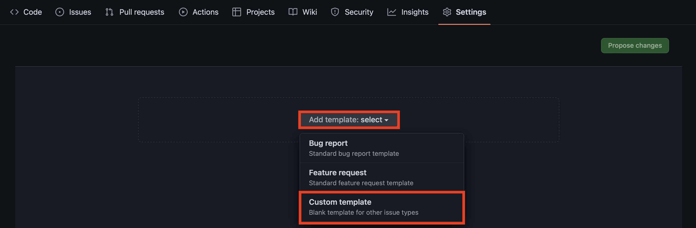
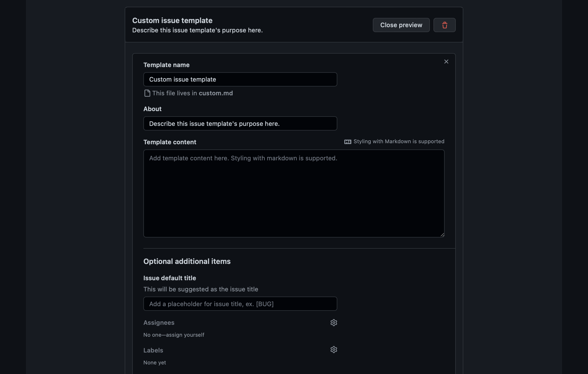
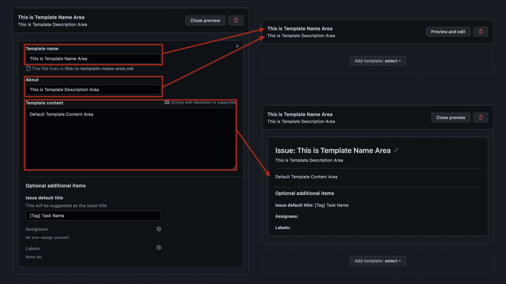
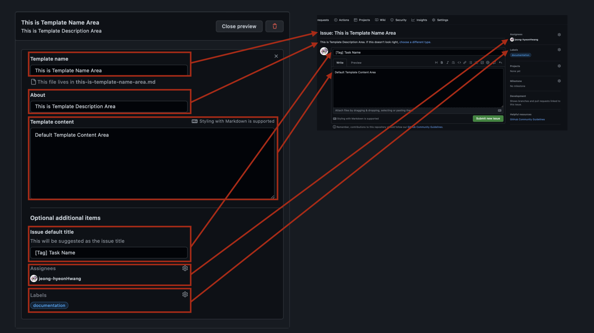

## Issue Template 만드는 법
1. Repository ->  Settings 클릭

2. General -> Set up templates 클릭

3. Template 선택 (Default로 제공되는 Template 이외의 것을 새롭게 작성하고 싶은 경우 Custom template 클릭)

4. Pencil 클릭

5. Template 작성 준비 완료!

---
### Template 요소
**Template Name**
- Template의 이름. Template이 하나 이상 존재하는 경우, Issue 작성 시 Template List가 뜨면서 표시되는 이름

**About**
- Template Name 하단에서 보여지는 Template에 대한 간략한 정보

**Template content**
- 해당 Template로 Issue 작성 시 보여지는 Default 정보

**Issue default title**
- 해당 Template로 Issue 작성 시 보여지는 Default Issue 이름

**Asignees**
- 해당 Issue 생성자, 혹은 해당 Task 관리자, 혹은 해당 Task 배정자. Template에서 Default Asignee를 설정하는 경우, 추후 Issue 생성 시 따로 할당할 필요가 없음

**Label**
- 해당 Issue가 어떤 작업을 수행하는지에 대한 정보
- *Label에 대한 설명은 추후 업로드 예정*
---

6. Template 작성 완료

- **⚠️Template 작성 완료 후 'Propose Changes' 버튼 클릭 후, 'Commit Changes'를 클릭하지 않을 경우 변경 사항은 저장되지 않습니다⚠️**

---
### 완료 후 화면 반영 사항

