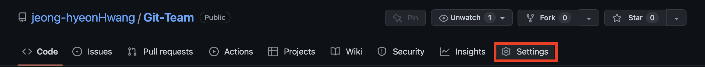
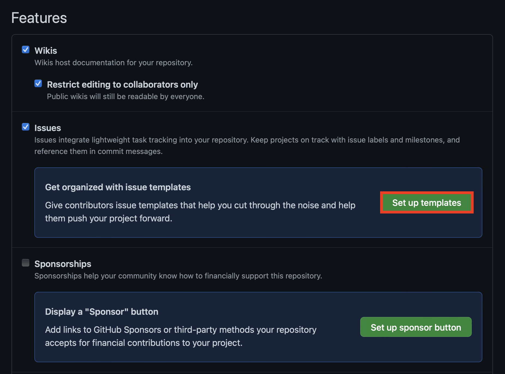
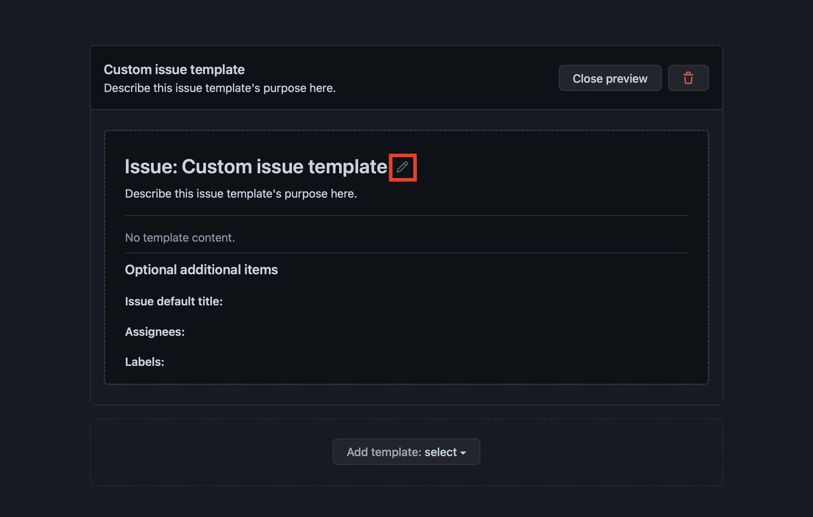

## Issue Template 作り方
1. Repository ->  Settings クリック

2. General -> Set up templates クリック

3. Template 選択 （Default以外のTemplateを作成したい場合、Custom templateをクリック）

4. Pencil クリック

5. Template 作成準備完了！

---
### Template 要素
**Template Name**
- Templateの名前. Templateが一つ以上存在する場合、Issue作成をする時、Template Listに表示される名前

**About**
- Template Name下に見えるTemplateに対する略した情報

**Template content**
- 該当 TemplateでIssueを作成する際に表示されるDefault情報

**Issue default title**
- 該当TemplateでIssueを作成する際に表示されるDefault Issueの名前

**Asignees**
- 該当Issue作成者、あるいは該当IssueTask管理者、あるいは該当IssueTaskを割り当てる者。 TemplateでDefaultAsigneeを設定する場合、今後Issue作成時に別に割り当てる必要がない。

**Label**
- 該当Issueがどのような作業を遂行するかの情報
- *Label説明は後でアップロード予定＊
---

6. Template 作成完了

- **⚠️Template作成完了後, 'Propose Changes'　クリック後、　'Commit Changes'を　クリックしない場合、変更事項はセーブされません⚠️**

---
### 完了後の画面反映事項

