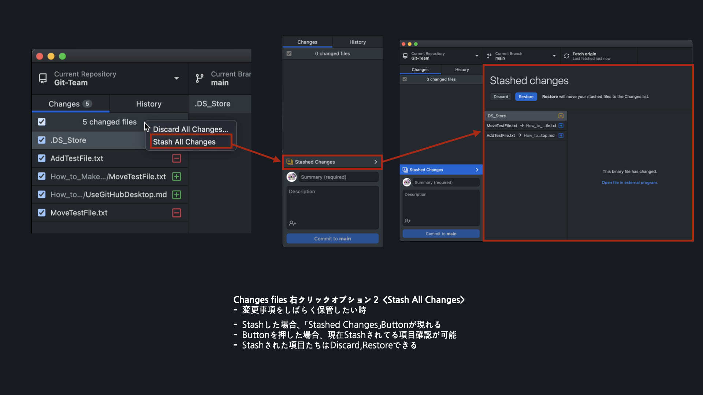

## GitHub Desktop　使い方
---
### 簡単な用語説明
**Branch**
- 作業する場所
- Task別に作業場所(Branch)を分ける
- Repository生成後DefaultBranchは「main」

**Remote**
- 遠隔リポジトリ
- 現在の私のComputerではなく、「遠隔」のリポジトリ
**Local**
- 自分のリポジトリ
- 現在自分のパソコンで更新される場所

**違います**
- **Commit**と**Pull Request**は違います
- **Push**と**Pull**は違います
- これらについての違いは後で話す予定

---
1. 領域説明

2. Changes Area

3. Discard & Stash

4. Branch

