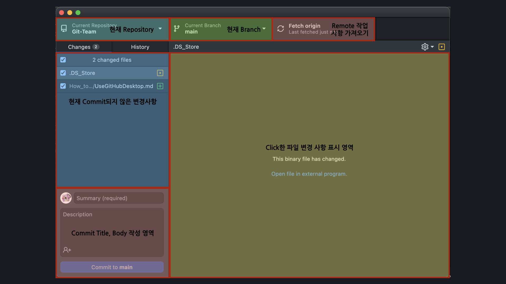
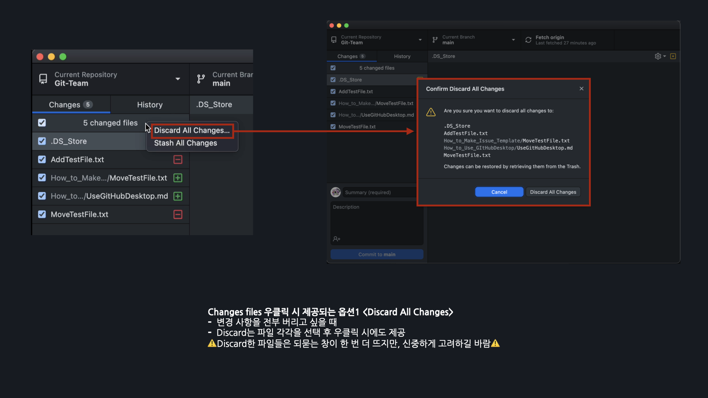
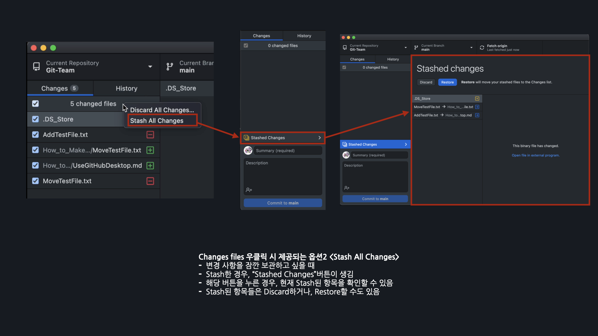
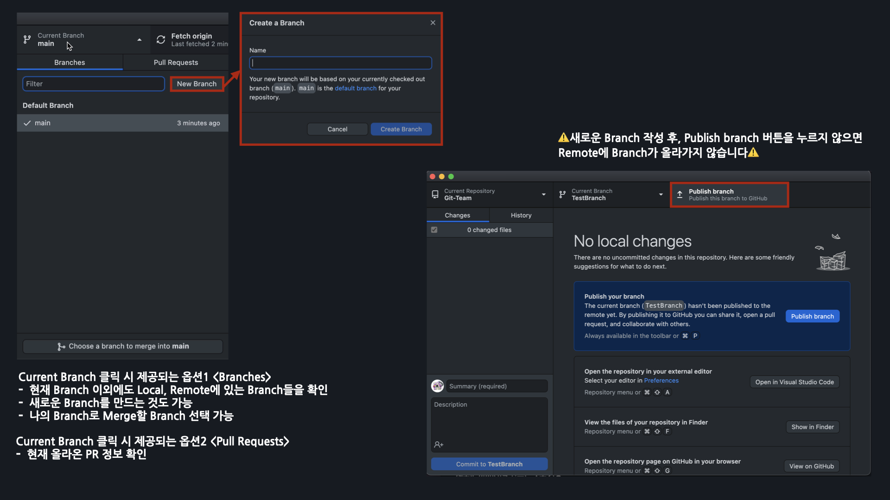

## GitHub Desktop　쓰는 법
---
### 간단한 용어 설명
**Branch**
- 작업하는 장소
- Task별로 작업 장소(Branch)를 나누어서 하는 편
- Repository 생성 후 Default Branch는 "main"

**Remote**
- 원격 저장소
- 현재 나의 Computer가 아닌 '원격'의 저장소
**Local**
- 나의 저장소
- 현재 나의 Computer에 저장되어 있는 곳

**개념만**
- **Commit**과 **Pull Request**는 다릅니다
- **Push**와 **Pull**은 다릅니다
- 이 차이에 대해서는 추후 설명 예정

---
1. 영역 설명

2. Changes Area

3. Discard & Stash

4. Branch

